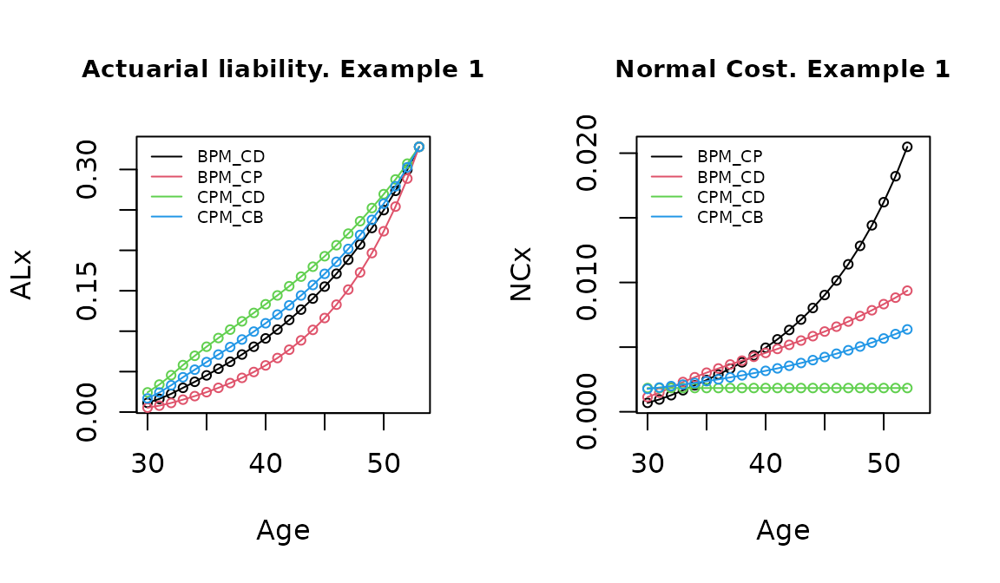
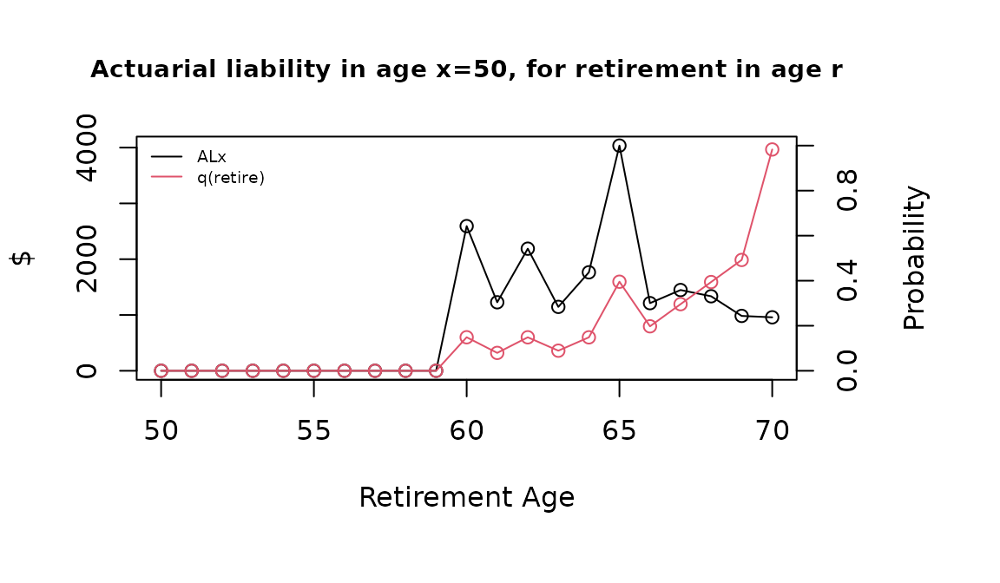

# Pensions valuation with lifecontingencies package

## Function *PensFund*

In this brief document we present a general function to valuate
actuarial liabilities and normal costs, allowing different methods in
pension funding for defined benefit schemes.

Each method is defined by the way that contributions are accrued in the
active age before the specific risk apply. Following (Winklevoss 1993)
and (Bowers et al. 1997), the Normal Cost and Actuarial Liability can be
seen as portions of $PVFNC_{x}^{r}$, the present value of future benefit
at age $x$ for the risk in $r$, and that’s the way that we treat this in
the function’s code. The methods that are implemented here are the
“Benefit Prorate Method, Constant Dollar”, “Benefit Prorate Method,
Constant Percent”, “Cost Prorate Method, Constant Dollar” and “Cost
Prorate Method, Constant Benefit” (the last two also called “entry age
methods”). For formula details the reader can go to chapters 5 and 6 on
(Winklevoss 1993).

We define a general function that allows to perform the calculations in
a multi-decrement environment, with flexibility to consider different
kind of benefit scheme, using functions of the “lifecontingencies”
package (Spedicato et. al., 2018). The arguments (following general
notation in Gian Paolo Clemente’s vignette titled “Pension Funding with
lifecontingencies”) are:

- $x$: the age of the insured at the time of valuation
- $y$: the age which the person entered to the job. This age is usually
  different than the age that the plan began
- $r$: age where the risk is evaluated
- $acttableAccPeriod$: multi-decrement object lifetable, where one of
  its decrements is the risk of interest. One of the most common
  applications is for and obligated retirement at age $r$, and even in
  this case is needed a multi-decrement table with risks of death and
  retirement (with certainty for age $r$)
- $decrement$: decrement to evaluate
- $i$: interest rate (real)
- $j$: salary rate increment (real, productivity and seniority included)
- $delta$: benefit rate increment (real)
- $n$: years that the benefit will be payed (can be 1 for single
  payments). If it is omitted, will take value $\omega - r$
- $avg$: number of past salaries to be considered for average
- $acttablePaymPeriod$: lifetable object for payment period
- $CostMet$: Method Cost, that could be “BPM_CD” (Benefit Prorate
  Method, Constant Dollar), “BPM_CP” (Benefit Prorate Method, Constant
  Percent), “CPM_CD” (Cost Prorate Method, Constant Dollar), “CPM_CB”
  (Cost Prorate Method, Constant Benefit).

The general function is:

``` r
require("lifecontingencies")
PensFund <- function(x, y, r, acttableAccPeriod, decrement, i, j, delta, n, avg,
    acttablePaymPeriod, CostMet) {
    if (missing(n))
        n <- getOmega(acttableAccPeriod) - x - 1
    if (x < y)
        stop("Entry age greater than actual age")
    if (missing(decrement))
        stop("Which is the contingency of benefit?")
    if (class(acttableAccPeriod) != "mdt")
        stop("Error! Needed Mdt")
    if (!(decrement %in% getDecrements(acttableAccPeriod)))
        stop("Error! Not recognized decrement type")
    if (missing(acttableAccPeriod))
        stop("Error! Need a lifetable or actuarialtable")
    if (missing(x) | missing(y))
        stop("Error! Need age and seniority!")
    if (x > getOmega(acttableAccPeriod)) {
        out = 0
        return(out)
    }
    if (missing(CostMet))
        CostMet = "BPM_CD"
    if (missing(avg))
        stop("Error! Need avg period of computing benefit")
    if (missing(j))
        stop("Error! Need average salary increase rate")
    if (any(x < 0, y < 0, avg < 0, delta < 0))
        stop("Error! Negative parameters")

    ########## survive all casuses
    acttableAccPeriodTotal = pxt(acttableAccPeriod, x = 0:(getOmega(acttableAccPeriod)),
        t = 1)
    acttableAccPeriodTotal = probs2lifetable(acttableAccPeriodTotal, type = "px")
    if (missing(acttablePaymPeriod))
        acttablePaymPeriod = acttableAccPeriodTotal

    ########## Set benefit fix age valuation
    x0 = x
    B = ifelse(avg == 0, 1, (1 + j)^(r - x0) * annuity(j, avg, m = 0, k = 1, type = "immediate")/avg)
    q.r = qxt(object = acttableAccPeriod, x = r, t = 1, decrement = decrement)
    Br = q.r * axn(acttablePaymPeriod, r, i = (1 + i)/(1 + delta) - 1, n = n, k = 1) *
        B

    ########## Actuarial liability in age x, fot the age r (r>=x)
    ALyNC.x.r = function(x, r) {

        ## PVFB

        PVFB.x = Exn(acttableAccPeriodTotal, x, r - x, i = i) * Br

        ## Normal Costs and liabilities under Actuarial Cost Methods

        if (CostMet == "BPM_CD") {
            K <- (x - y)/(r - y)
            k <- 1/(r - y)
        }

        if (CostMet == "BPM_CP") {
            K <- (1 + j)^(x - x0) * annuity(j, x - y + 1, m = 0, k = 1, type = "immediate")/((1 +
                j)^(r - x0) * annuity(j, r - y + 1, m = 0, k = 1, type = "immediate"))
            k <- (1 + j)^(x - x0)/(annuity(j, r - y, m = 0, k = 1, type = "immediate") *
                (1 + j)^(r - x0))
        }

        if (CostMet == "CPM_CD") {
            K <- axn(acttableAccPeriodTotal, y, i = i, n = x - y, k = 1)/axn(acttableAccPeriodTotal,
                y, i = i, n = r - y, k = 1)
            k <- Exn(acttableAccPeriodTotal, y, x - y, i = i)/axn(acttableAccPeriodTotal,
                y, i = i, n = r - y, k = 1)
        }

        if (CostMet == "CPM_CB") {
            K <- axn(acttableAccPeriodTotal, y, i = (1 + i)/(1 + j) - 1, n = x -
                y, k = 1)/axn(acttableAccPeriodTotal, y, i = (1 + i)/(1 + j) - 1,
                n = r - y, k = 1)
            k <- Exn(acttableAccPeriodTotal, y, x - y, i = i) * (1 + j)^(x - y)/axn(acttableAccPeriodTotal,
                y, i = (1 + i)/(1 + j) - 1, n = r - y, k = 1)
        }

        ## Results

        outAL.x.r <- PVFB.x * K
        outNC.x.r <- PVFB.x * k
        outPVFB.x <- PVFB.x
        out.x.r <- c(outAL.x.r, outNC.x.r, outPVFB.x)

        return(out.x.r)
    }

    ######## AL y NC for the rest of ages

    ages_risk = x:r
    outAL.x = sapply(ages_risk, function(x) ALyNC.x.r(x, r)[1])
    outNC.x = sapply(ages_risk, function(x) ALyNC.x.r(x, r)[2])
    outPVFB.x = sapply(ages_risk, function(x) ALyNC.x.r(x, r)[3])
    outNC.x[length(ages_risk)] = NA
    out.x <- data.frame(x = ages_risk, AL = outAL.x, NC = outNC.x, PVFB = outPVFB.x)

    return(out.x)
}
```

### First (main) example

A first example of application is of a person aged 30 (entered to job at
age 20), with a benefit in case of disability, that is the average of
the last 5 salaries before get disabled. For calculate that we’ll use
the multi-decrement table ‘SoAISTdata’ for the accrued period and
‘soa08’ for the payment period, both available in “lifecontingencies”
package.

``` r
data(SoAISTdata)
data(soa08)
MultiDecrTable <- new("mdt", name = "testMDT", table = SoAISTdata)
#> Added fictional decrement below last x and completed x and lx until zero....
```

The specific name of this risk in the table is ‘inability’.

``` r
getDecrements(MultiDecrTable)
#> [1] "death"      "withdrawal" "inability"  "retirement"
```

Now we calculate the liability and normal cost with the four methods,
and $i = .04$, $j = .06$, $delta = .03$, $avg = 5$. In this case for the
age risk 53 ($r = 53$).

``` r
x1=30
y1=20
r1=53
decrement1 = "inability"
BPM_CD = PensFund(x1, y1, r1, acttableAccPeriod = MultiDecrTable, decrement = decrement1,  
                  i = .04, j = .06, delta = .03, avg = 5, 
                  acttablePaymPeriod = soa08, CostMet = 'BPM_CD')
BPM_CP = PensFund(x1, y1, r1, acttableAccPeriod = MultiDecrTable, decrement = decrement1,  
                  i = .04, j = .06, delta = .03, avg = 5, 
                  acttablePaymPeriod = soa08, CostMet = 'BPM_CP')
CPM_CD = PensFund(x1, y1, r1, acttableAccPeriod = MultiDecrTable, decrement = decrement1,  
                  i = .04, j = .06, delta = .03, avg = 5, 
                  acttablePaymPeriod = soa08, CostMet = 'CPM_CD')
CPM_CP = PensFund(x1, y1, r1, acttableAccPeriod = MultiDecrTable, decrement = decrement1,  
                  i = .04, j = .06, delta = .03, avg = 5, 
                  acttablePaymPeriod = soa08, CostMet = 'CPM_CB')
```

The way that each method amortize the benefit cost in active years can
be seen in the next graph, showing the liability accumulated
relationship between at any age: “CPM_CD” $\geq$ “CPM_CB”$\geq$ “BPM_CD”
$\geq$ “BPM_CP”.



We can check the results with actuarial equivalences, specifically the
formulas $AL_{x}^{r} = PVFB_{x}^{r} - PVFNC_{x}^{r}$ (6.3a) and
$AL_{x}^{r} = AVPNC_{x}^{r}$ (6.4a) in (Winklevoss 1993), which means
that the actuarial liability at any time can be expressed as the
difference between the present value of future benefit and the present
value of future normal costs, and as the actuarial value of past normal
costs (retrospective view).

``` r
# AL = PVBF - PVFNC first get survivial for all causes
acttableAccPeriodTotal = pxt(MultiDecrTable, x = 0:(getOmega(MultiDecrTable)), t = 1)
acttableAccPeriodTotal = probs2lifetable(acttableAccPeriodTotal, type = "px")
# are equal?
round(BPM_CD$AL[1], 10) == round(BPM_CD$PVFB[1] - sum(sapply(x1:(r1 - 1), function(x) Exn(acttableAccPeriodTotal,
    x1, x - x1, i = 0.04) * BPM_CD$NC[x - x1 + 1])), 10)
#> [1] TRUE
```

``` r
# Restrospective AL First get the liability at entry age y
BPM_CD_y = PensFund(y1, y1, r1, acttableAccPeriod = MultiDecrTable, decrement = decrement1,
    i = 0.04, j = 0.06, delta = 0.03, avg = 5, acttablePaymPeriod = soa08, CostMet = "BPM_CD")
# are equal?
round(BPM_CD_y$AL[BPM_CD_y$x == 45], 10) == round(sum(sapply(y1:44, function(y) (1.04)^(45 -
    y)/pxt(acttableAccPeriodTotal, y, 45 - y) * BPM_CD_y$NC[BPM_CD_y$x == y])), 10)
#> [1] TRUE
```

### Second example

Now we’ll evaluate a retirement pension, that receives a payment grade
which is a lineal function between age 60 and the maximum possible age
of retirement at 70, and goes from 50% to 100%. This is not a grading
function in which benefit provided at early or late retirement has the
same present value as the benefit payable at normal retirement
((Winklevoss 1993), chapter 9). Instead, here the person is penalyzed
for early retirement. The insured has an annual salary of 5000 at age
$x$. Also there is a seniority condition of 10 years. The other
parameters are the same that the previous example.

``` r
x2 = 50
y2 = 35
decrement2 = "retirement"
pay_grade = data.frame(x = x2:70, gr = c(rep(0, 10), seq(0.5, 1, 0.05)))
snty_req = 20
s_x = 5000
Cost_Method2 = "BPM_CD"
```

The calculation now focus on estimate the actuarial values at age $x2$,
for all the retirement scheme (all ages between $x2$ and 70).

``` r
AL_xr = data.frame(r = 0, AL = 0, NC = 0)
for (r in x2:70) {
    if ((r - y2) < snty_req)
        AL_xr[r - x2 + 1, 2:3] = c(0, 0) else {
        AL_xr[r - x2 + 1, 2:3] = s_x * pay_grade[pay_grade$x == r, 2] * PensFund(x2,
            y2, r, acttableAccPeriod = MultiDecrTable, decrement = decrement2, i = 0.04,
            j = 0.06, delta = 0.03, avg = 5, acttablePaymPeriod = soa08, CostMet = Cost_Method2)[1,
            2:3]
    }
    AL_xr[r - x2 + 1, 1] = r
}
```

The total liability at age x is 1.88917^{4} and is distributed between
this retirement options, influenced by the progressive function of the
early retirement *pay_grade*) and the individual’s expected behavior
(probability of retirement).



### Third example

Now let’s imagine that the same insured has the benefit of receive a 50%
of his/her last salary at each age before retirement if he decide to
leave the Company. The benefit is in concept of recognition of past
contributions to the pension plan. This benefit can be estimated setting
$n = 1$ (no rent, a single payment) and $avg = 0$ (only last salary).
For example, for the risk of withdrawal at age 45:

``` r
decrement3 = "withdrawal"
x3 = 30
y3 = 20
r3 = 45
BPM_CP3 = s_x * 0.5 * PensFund(x3, y3, r3, acttableAccPeriod = MultiDecrTable, decrement = decrement3,
    i = 0.04, j = 0.06, delta = 0.03, avg = 0, n = 1, acttablePaymPeriod = soa08,
    CostMet = "BPM_CP")
```


### Future improvements:

The following improvements are planned:

1.  Because a payment can’t be done before the contingency occurs, an
    assumption about occurrence and payment must be done. We will
    improve the function to consider payments at half of the year. This
    affects only the financial component, and little bit the final
    results.
2.  Make the benefit rent payable for a designed survivor too, and with
    a portion of the titular benefit. This also allows to include death
    as a main benefit risk.

## References

Bowers, N. L., D. A. Jones, H. U. Gerber, C. J. Nesbitt, and J. C.
Hickman. 1997. *Actuarial Mathematics, 2nd Edition*. Society of
Actuaries.

Winklevoss, Howard E. 1993. *Pension Mathematics with Numerical
Illustrations*. University of Pennsylvania Press.
