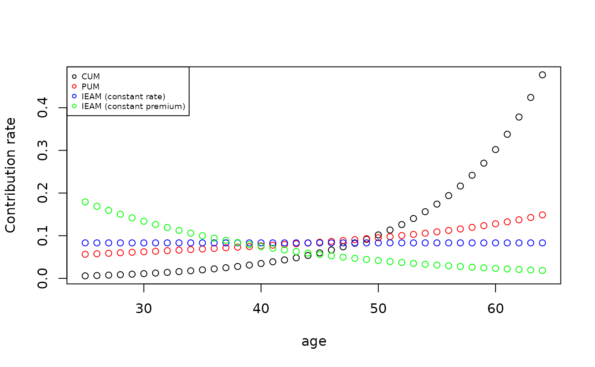
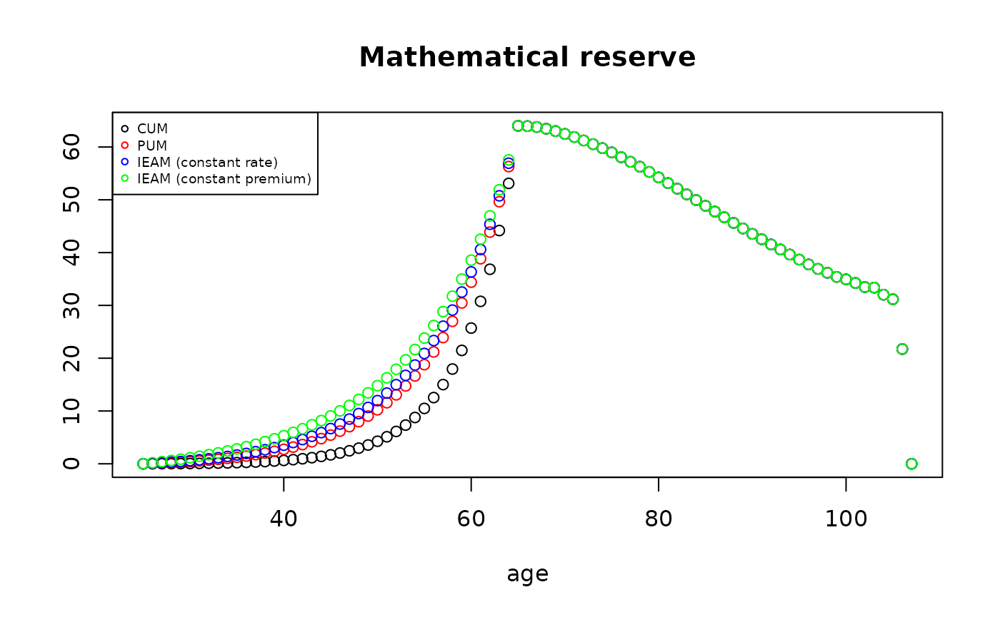

# Pension Funding with lifecontingencies

## Introduction and some general settings

This report focuses on several funding and actuarial costing methods in
occupational pension funds where the benefits are defined. As
well-known, a defined benefit (DB) pension plan is a type of pension
plan in which an employer/sponsor promises a specified pension payment,
lump-sum (or combination thereof) on retirement that is predetermined by
a formula based on the employee’s history (earnings, tenure of service
and age, etc.) rather than depending directly on individual investment
returns. The first consideration is what constitutes the “retirement
provision”. We could argue that provisions regard any savings or
investments made by an individual for later life. For the sake of
brevity, we only focus here on the actuarial involvement in the
provision of retirement benefits by employers, groups of employers and
professions for their members (i.e the so called “second pillar” of
retirement provisions). This provision is usually designed to supplement
and in some cases replace (“contracted out” pension schemes in the
United Kingdom) the compulsory state pension arrangements. The main
benefits are usually at least both a pension payable for life from the
attainment of a specified retirement age and a pension payable to the
widow/er on the death of the employee/member, according to the death of
either the active member or the retired member. These core benefits are
found in almost every pension funds, albeit in differing forms. Also
additional benefits are usually provided in variable frameworks
(e.g. disability for instance).  
In the next, we focus on a specific defined benefit pension fund by
considering only the retirement benefit for the sake of simplicity. We
present some well-known funding methods and we show how to evaluate both
premium rate and technical reserve via life contingencies package
dedicated functions. To this aim we follow a cohort approach by
considering a group of people who share the same characteristic in terms
of age of affiliation $\alpha$ with the pension plan, sex, age of
retirement $\beta$ and initial salary ($s_{\alpha}$). We consider a DB
scheme where the pension on retirement is fixed in advance as a
proportion of the member’s salary in their last year of service. So the
level of the pension at the time of benefit entitlement is based on a
proportional-earnings related formula and benefit is expressed as a
pension annuity $b_{x}$, starting at age $\beta$, annually increasing at
the rate $\delta$ and payable until death:
$$b_{x} = (1 + \delta)^{x - \beta}\left( \frac{\beta - \alpha}{t} \right)s_{\beta}$$
In particular, we are assuming that:

In other words, the pension plan guarantees a replacement ratio equal
to:
$$RR_{\beta} = \frac{s_{\beta}}{b_{\beta}} = \left( \frac{\beta - \alpha}{t} \right)$$

Furthermore, we assume that annual earnings are increasing at a yearly
flat rate $i$: $$s_{x} = s_{x - 1}(1 + j)$$ This evolution of earnings,
defined by the rate $j$, is usually considered to include two
components:

## Contribution rate and technical reserves

Our first aim is to quantify the level of contribution to be set at a
level to produce the targeted pension on retirement. In this framework,
two general approaches can be pursued. On one hand, the accrued benefits
cost method defines the annual normal cost on the basis of portion of
pension benefit matured at the valuation date. Accrued Benefits Funding
Methods are indeed a major category of funding methods in which the
Actuarial Liability for active members is based on pensionable service
accrued up to the valuation date or to the end of the Control Period, as
appropriate. Differences between the various Accrued Benefits Funding
Methods arise from the treatment of decrements in membership and
increases in pensionable pay when calculating the Actuarial Liabilities
for active members. This affects the value placed not only on the
Actuarial Liability but also on the Standard Contribution Rate. Main
examples treated in the next are Current Unit Method and Projected Unit
Method. \\ On the other hand the Projected Benefit Cost Methods, that
include several methods (as Individual Entry-Age Method for instance),
quantifies a normal cost that represents an amount that will provide for
the estimated projected retirement benefits over the service lives of
either the individual employees or the employee group. Pension costs
computed under this approach tend to be stable or decline year by year,
depending on the method selected.

We begin by the Current Unit Method (CUM). The Actuarial Liability for
active members is calculated taking into account all types of decrement
(in our case only retirement). In calculating the Actuarial Liability as
at the valuation date pensionable pay is not projected. It is now
possible to define the following mathematical reserve V\_{x} at age $x$
($\alpha \leq x < \beta$):
$$V_{x} = {}_{\beta - x}E_{x}^{p^{ap},i^{ap}}\left( \frac{x - \alpha}{t}s_{x - 1} \right){\ddot{a}}_{\beta}^{p^{pp},u}$$
where $p^{ap}$ and $p^{pp}$ are the survival probabilities in
accumulation and payment periods respectively, $i^{ap}$ is the technical
financial rate in the accumulation period,
$u = \frac{1 + i^{pp}}{1 + \delta} - 1$ is a synthetic index function of
the technical financial rate $i^{pp}$ in the payment period and the
indexation of the pension amount. Notice that $p^{pp}$ and $j^{pp}$ may
depend on premium rate requested by the insurer when an agreement is
made between pension plan and insurer for the payments of annuity
amounts.
${}_{\beta - x}E_{x}^{p^{ap},i^{ap}} = \frac{{}_{\beta - x}p_{x}^{ap}}{(1 + i)^{\beta - x}}$
is the actuarial present value of a life-contingent $\beta - x$-year
future payment of 1. While ${\ddot{a}}_{\beta}^{p^{pp},u}$ is the
expected present value for the life-annuity due of infinite-duration. By
applying Fouret’s formula, it is easily derive the contribution rate
$\gamma_{x}$ as:
$$\gamma_{x} = {}_{\beta - x}E_{x}^{p^{ap},i^{ap}}\frac{1}{t}\left( 1 + \frac{j}{1 + j}(x - \alpha) \right){\ddot{a}}_{\beta}^{p^{pp},u}$$
In such calculations, allowance is made for increases in the benefits
between the relevant date and the assumed date of retirement because of
the future increases in salaries. Finally

The Projected Unit Method is based on a similar structure of CUM, but
the pensionable pay is projected from the relevant date up to the
assumed date of retirement. This method is also known as the Projected
Unit Credit Method. We have then the following relations for the
mathematical reserve and the contribution rate respectively:
$$V_{x} = {}_{\beta - x}E_{x}^{p^{ap},i^{ap}}\left( \frac{x - \alpha}{t}s_{\beta - 1} \right){\ddot{a}}_{\beta}^{p^{pp},u}$$$$\gamma_{x} = {}_{\beta - x}E_{x}^{p^{ap},i^{ap}}\frac{1}{t}(1 + j)^{\beta - x - 1}{\ddot{a}}_{\beta}^{p^{pp},u}$$
In this case, the normal cost depends yearly on a portion $\frac{1}{t}$
of the expected earning at the last year of service before than
retirement.

Finally, we consider Individual Entry-Age Method. This method assumes
that every employee entered the plan (thus, entry age) at the time of
employment and that contributions have been made on this basis from the
entry age to the date of valuation. The contributions are the level
annual amounts which, if accumulated at the rate of interest used in the
actuarial valuation, would result in a fund equal to the present value
of the pension benefits at retirement for employees that survive at that
time. In this case the contribution rate is equal to the ratio of
expected present value of future benefits to expected present value of
future earnings:
$$\gamma_{x} = \frac{{}_{\beta - \alpha}E_{\alpha}^{p^{ap},i^{ap}}\left( \frac{\beta - \alpha}{t}s_{\beta - 1} \right){\ddot{a}}_{\beta}^{p^{pp},u}}{s_{\alpha}{}_{\beta - \alpha}{\ddot{a}}_{\alpha}^{p^{pp},r}}$$
where $u = \frac{1 + i^{pp}}{1 + j} - 1$ is a syntethic index function
of the technical financial rate $i^{pp}$ in the payment period and the
annual salary increase $j$. In this case, $\gamma_{x}$ is constant over
time.

Mathematical reserve can be derived in a perspective view as:
$$V_{x} = {}_{\beta - x}E_{x}^{p^{ap},i^{ap}}\left( \frac{\beta - \alpha}{t}s_{\beta - 1} \right){\ddot{a}}_{\beta}^{p^{pp},u} - \gamma_{x}s_{x}{}_{\beta - x}{\ddot{a}}_{x}^{p^{pp},r}$$

## Functions definitions

The CUM contribution rate is defined by following function:

``` r
CUM <- function(acttableAccPeriod, x, beta, i = actuarialtable@interest, j, t, k = 1,
    payment = "advance", acttablePaymPeriod, i2, delta = 0) {

    out <- numeric(1)
    if (missing(acttableAccPeriod))
        stop("Error! Need an actuarial actuarialtable")
    if (missing(acttablePaymPeriod))
        acttablePaymPeriod = acttableAccPeriod
    if (missing(i2))
        i2 = i
    if (missing(x))
        stop("Error! Need age!")
    if (missing(beta))
        stop("Error! Retirement age!")
    if (x > getOmega(acttableAccPeriod)) {
        out = 0
        return(out)
    }
    if (missing(t))
        stop("Error! Need t")
    if (missing(j))
        stop("Error! Need average salary increase rate")
    if (any(x < 0, beta < 0, t < 0))
        stop("Error! Negative parameters")
    out = sapply(seq(x, beta - 1, 1), function(h) Exn(acttableAccPeriod, h, beta -
        h, i = i) * ((1/t) + (h - x)/t * (j/(1 + j))) * axn(acttablePaymPeriod, beta,
        i = (1 + i2)/(1 + delta) - 1, k = 1))
    return(out)
}
```

The mathematical reserve is instead equal to:

``` r
CUMmr <- function(acttableAccPeriod, x, beta, i = actuarialtable@interest, j, t,
    k = 1, payment = "advance", acttablePaymPeriod, i2, delta = 0) {

    out <- numeric(1)
    if (missing(acttableAccPeriod))
        stop("Error! Need an actuarial actuarialtable")
    if (missing(acttablePaymPeriod))
        acttablePaymPeriod = acttableAccPeriod
    if (missing(i2))
        i2 = i
    if (missing(x))
        stop("Error! Need age!")
    if (missing(beta))
        stop("Error! Retirement age!")
    if (x > getOmega(acttableAccPeriod)) {
        out = 0
        return(out)
    }
    if (missing(t))
        stop("Error! Need t")
    if (missing(j))
        stop("Error! Need average salary increase rate")
    if (any(x < 0, beta < 0, t < 0))
        stop("Error! Negative parameters")
    out = c(sapply(seq(x, beta, 1), function(h) Exn(acttableAccPeriod, h, beta -
        h, i = i) * ((h - x)/t * (1 + j)^(h - x - 1)) * axn(acttablePaymPeriod, beta,
        i = (1 + i2)/(1 + delta) - 1, k = 1)), sapply(seq(beta + 1, getOmega(acttablePaymPeriod) +
        1, 1), function(h) ((beta - x)/t * (1 + j)^(beta - x - 1)) * (1 + delta)^(h -
        beta) * axn(acttablePaymPeriod, h, i = (1 + i2)/(1 + delta) - 1, k = 1)))
    return(out)
}
```

The PUM contribution rate is defined by the following function:

``` r
# Projected Unit Method
PUM <- function(acttableAccPeriod, x, beta, i = actuarialtable@interest, j, t, k = 1,
    payment = "advance", acttablePaymPeriod, i2, delta = 0) {

    out <- numeric(1)
    if (missing(acttableAccPeriod))
        stop("Error! Need an actuarial actuarialtable")
    if (missing(acttablePaymPeriod))
        acttablePaymPeriod = acttableAccPeriod
    if (missing(i2))
        i2 = i
    if (missing(x))
        stop("Error! Need age!")
    if (missing(beta))
        stop("Error! Retirement age!")
    if (x > getOmega(acttableAccPeriod)) {
        out = 0
        return(out)
    }
    if (missing(t))
        stop("Error! Need t")
    if (missing(j))
        stop("Error! Need average salary increase rate")
    if (any(x < 0, beta < 0, t < 0))
        stop("Error! Negative parameters")
    out = sapply(seq(x, beta - 1, 1), function(h) Exn(acttableAccPeriod, h, beta -
        h, i = i) * 1/t * axn(acttablePaymPeriod, beta, i = (1 + i2)/(1 + delta) -
        1, k = 1) * (1 + j)^(beta - h - 1))
    return(out)
}
```

while the mathematical reserve is

``` r
PUMmr <- function(acttableAccPeriod, x, beta, i = actuarialtable@interest, j, t,
    k = 1, payment = "advance", acttablePaymPeriod, i2, delta = 0) {

    out <- numeric(1)
    if (missing(acttableAccPeriod))
        stop("Error! Need an actuarial actuarialtable")
    if (missing(acttablePaymPeriod))
        acttablePaymPeriod = acttableAccPeriod
    if (missing(i2))
        i2 = i
    if (missing(x))
        stop("Error! Need age!")
    if (missing(beta))
        stop("Error! Retirement age!")
    if (x > getOmega(acttableAccPeriod)) {
        out = 0
        return(out)
    }
    if (missing(t))
        stop("Error! Need t")
    if (missing(j))
        stop("Error! Need average salary increase rate")
    if (any(x < 0, beta < 0, t < 0))
        stop("Error! Negative parameters")
    out = c(sapply(seq(x, beta, 1), function(h) Exn(acttableAccPeriod, h, beta -
        h, i = i) * ((h - x)/t * (1 + j)^(beta - x - 1)) * axn(acttablePaymPeriod,
        beta, i = (1 + i2)/(1 + delta) - 1, k = 1)), sapply(seq(beta + 1, getOmega(acttablePaymPeriod) +
        1, 1), function(h) ((beta - x)/t * (1 + j)^(beta - x - 1)) * (1 + delta)^(h -
        beta) * axn(acttablePaymPeriod, h, i = (1 + i2)/(1 + delta) - 1, k = 1)))
    return(out)
}
```

The IEAM is defined as follows:

``` r
# Individual Entry-Age Unit Method Type: 0 constant contribution rate, 1 #
# Constant Contribution amount (Default is 0)
IEAM <- function(acttableAccPeriod, x, beta, i = actuarialtable@interest, j, t, k = 1,
    payment = "advance", acttablePaymPeriod, i2, delta = 0, type = 0) {

    out <- numeric(1)
    if (missing(acttableAccPeriod))
        stop("Error! Need an actuarial actuarialtable")
    if (missing(acttablePaymPeriod))
        acttablePaymPeriod = acttableAccPeriod
    if (missing(i2))
        i2 = i
    if (missing(x))
        stop("Error! Need age!")
    if (missing(beta))
        stop("Error! Retirement age!")
    if (x > getOmega(acttableAccPeriod)) {
        out = 0
        return(out)
    }
    if (missing(t))
        stop("Error! Need t")
    if (missing(j))
        stop("Error! Need average salary increase rate")
    if (any(x < 0, beta < 0, t < 0))
        stop("Error! Negative parameters")
    if (type == 0) {
        out = (Exn(acttableAccPeriod, x, beta - x, i = i) * (beta - x)/t * axn(acttablePaymPeriod,
            beta, i = (1 + i2)/(1 + delta) - 1, k = 1) * (1 + j)^(beta - x - 1))/(axn(acttablePaymPeriod,
            x, beta - x, i = (1 + i)/(1 + j) - 1, k = 1, payment = "advance"))
    } else {
        out = ((Exn(acttableAccPeriod, x, beta - x, i = i) * (beta - x)/t * axn(acttablePaymPeriod,
            beta, i = (1 + i2)/(1 + delta) - 1, k = 1) * (1 + j)^(beta - x - 1))/(axn(acttablePaymPeriod,
            x, beta - x, i, k = 1, payment = "advance")))/(1 + j)^seq(0, beta - x -
            1, 1)
    }
    return(out)
}
```

while the reserve is:

``` r
IEAMmr <- function(acttableAccPeriod, x, beta, i = actuarialtable@interest, j, t,
    k = 1, payment = "advance", acttablePaymPeriod, i2, delta = 0, type = 0) {

    out <- numeric(1)
    if (missing(acttableAccPeriod))
        stop("Error! Need an actuarial actuarialtable")
    if (missing(acttablePaymPeriod))
        acttablePaymPeriod = acttableAccPeriod
    if (missing(i2))
        i2 = i
    if (missing(x))
        stop("Error! Need age!")
    if (missing(beta))
        stop("Error! Retirement age!")
    if (x > getOmega(acttableAccPeriod)) {
        out = 0
        return(out)
    }
    if (missing(t))
        stop("Error! Need t")
    if (missing(j))
        stop("Error! Need average salary increase rate")
    if (any(x < 0, beta < 0, t < 0))
        stop("Error! Negative parameters")
    al = IEAM(acttableAccPeriod, x, beta, i, j, t, k = 1, payment, acttablePaymPeriod,
        i2, delta, type)
    if (type == 0) {
        out = c(sapply(seq(x, beta, 1), function(h) Exn(acttableAccPeriod, h, beta -
            h, i = i) * ((beta - x)/t * (1 + j)^(beta - x - 1)) * axn(acttablePaymPeriod,
            beta, i = (1 + i2)/(1 + delta) - 1, k = 1) - al * (1 + j)^(h - x) * axn(acttableAccPeriod,
            h, beta - h, i = (1 + i)/(1 + j) - 1, k = 1)), sapply(seq(beta + 1, getOmega(acttablePaymPeriod) +
            1, 1), function(h) ((beta - x)/t * (1 + j)^(beta - x - 1)) * (1 + delta)^(h -
            beta) * axn(acttablePaymPeriod, h, i = (1 + i2)/(1 + delta) - 1, k = 1)))
    } else {
        out = c(sapply(seq(x, beta - 1, 1), function(h) Exn(acttableAccPeriod, h,
            beta - h, i = i) * ((beta - x)/t * (1 + j)^(beta - x - 1)) * axn(acttablePaymPeriod,
            beta, i = (1 + i2)/(1 + delta) - 1, k = 1) - al[h - x + 1] * (1 + j)^(h -
            x) * axn(acttableAccPeriod, h, beta - h, i, k = 1)), sapply(seq(beta,
            getOmega(acttablePaymPeriod) + 1, 1), function(h) ((beta - x)/t * (1 +
            j)^(beta - x - 1)) * (1 + delta)^(h - beta) * axn(acttablePaymPeriod,
            h, i = (1 + i2)/(1 + delta) - 1, k = 1)))
    }
    return(out)
}
```

## An applied example

We consider a pension fund based on a single cohort of age $x = 25$.
Furthermore, we assume that the DB pension fund has based the
quantification of the contribution rate on the following assumptions:

``` r
#Current Unit Method
beta=65 # Beta Retirement age
x=25 #x Age of the insured.
i=0.08 # Interest Rate
t=60 #1/t is the % of the salary, recognized as retirement pension, for each year of service
j=0.06 #  average salary increases (for both growth in wages and promotional salary for seniority)
delta=0.03 #Increase of retirement pension
```

Therefore, the following Figure shows the pattern of the contribution
rates according to the three methods. As expected, Current Unit Method,
being based on the current salary, shows a very increasing tendency over
time. Differences with respect to PUM depends on the value of $j$. It is
indeed easy to prove that both methods lead to the same rates when
$j = 0$.

``` r
CUM(lt, x, beta, i, j, t, k, delta = 0.03)
#>  [1] 0.005822138 0.006650426 0.007574599 0.008604814 0.009752572 0.011030349
#>  [7] 0.012451659 0.014031470 0.015785917 0.017732613 0.019892423 0.022287570
#> [13] 0.024944411 0.027891562 0.031161684 0.034789025 0.038809741 0.043261288
#> [19] 0.048190217 0.053654252 0.059720601 0.066460108 0.073948311 0.082275637
#> [25] 0.091541182 0.101843507 0.113305658 0.126075296 0.140313448 0.156231670
#> [31] 0.174053818 0.194038950 0.216455210 0.241663403 0.270040950 0.301944371
#> [37] 0.337753233 0.378197856 0.424173906 0.477146484
PUM(lt, x, beta, i, j, t, k, delta = 0.03)
#>  [1] 0.05649516 0.05761827 0.05876254 0.05992897 0.06112051 0.06233840
#>  [7] 0.06358260 0.06485374 0.06615106 0.06747371 0.06882648 0.07021087
#> [13] 0.07163372 0.07309933 0.07461391 0.07617857 0.07779114 0.07944581
#> [19] 0.08114731 0.08290956 0.08474870 0.08667313 0.08868637 0.09079901
#> [25] 0.09301872 0.09534136 0.09777603 0.10033939 0.10304315 0.10591941
#> [31] 0.10898737 0.11226874 0.11577071 0.11953040 0.12356718 0.12787015
#> [37] 0.13242412 0.13732918 0.14269515 0.14875743
IEAM(lt, x, beta, i, j, t, k, delta = 0.03, type = 0)
#> [1] 0.08319755
plot(seq(x, beta - 1, 1), CUM(lt, x, beta, i, j, t, k, delta = 0.03), xlab = "age",
    ylab = "Contribution rate")
lines(seq(x, beta - 1, 1), PUM(lt, x, beta, i, j, t, k, delta = 0.03), type = "p",
    col = "red")
lines(seq(x, beta - 1, 1), rep(IEAM(lt, x, beta, i, j, t, k, delta = 0.03), beta -
    x), type = "p", col = "blue")
lines(seq(x, beta - 1, 1), IEAM(lt, x, beta, i, j, t, k, delta = 0.03, type = 1),
    type = "p", col = "green")
legend("topleft", c("CUM", "PUM", "IEAM (constant rate)", "IEAM (constant premium)"),
    col = c("black", "red", "blue", "green"), pch = c(1, 1, 1, 1), cex = 0.6)
```

 According to the
mathematical reserve, we observe in the following figure the different
behavior in the accumulation period.

``` r
CUMmr(lt, x, beta, i, j, t, k, delta = 0.03)
#>  [1]  0.000000000  0.006294153  0.014425118  0.024794687  0.037884301
#>  [6]  0.054268732  0.074632040  0.099788513  0.130703134  0.168518676
#> [11]  0.214604216  0.270577376  0.338380158  0.420314741  0.519131606
#> [16]  0.638065743  0.780913988  0.952104764  1.156972896  1.401995135
#> [21]  1.694973952  2.045104602  2.463218975  2.962403170  3.558184907
#> [26]  4.268546553  5.115359373  6.125158439  7.329443344  8.767567809
#> [31] 10.486117818 12.541502867 14.999937417 17.945055126 21.475647617
#> [36] 25.704738153 30.765026526 36.843761121 44.177787148 53.108760175
#> [41] 64.013001539 63.950042392 63.786308425 63.458208104 63.010871760
#> [46] 62.470417921 61.892955313 61.234081591 60.541207872 59.775674960
#> [51] 58.978980578 58.068490145 57.190779730 56.267230926 55.281780098
#> [56] 54.237763837 53.161703025 52.103448744 51.030105894 49.948433457
#> [61] 48.860816588 47.771875163 46.694105327 45.623247698 44.574315474
#> [66] 43.540573624 42.529253726 41.546222447 40.588424897 39.630039904
#> [71] 38.672686843 37.759069201 36.916230493 36.183917639 35.402016497
#> [76] 34.928684057 34.246062791 33.473705370 33.371432327 32.030006954
#> [81] 31.164732706 21.735202923  0.000000000
PUMmr(lt, x, beta, i, j, t, k, delta = 0.03)
#>  [1]  0.00000000  0.06107536  0.13205117  0.21412908  0.30865295  0.41711418
#>  [7]  0.54115881  0.68261229  0.84347787  1.02595866  1.23257742  1.46609318
#> [13]  1.72969335  2.02690308  2.36172848  2.73849568  3.16186970  3.63680185
#> [19]  4.16919512  4.76617163  5.43601108  6.18766746  7.03086236  7.97707864
#> [25]  9.03904102 10.22982022 11.56533624 13.06452353 14.74828004 16.64346133
#> [31] 18.77903994 21.18860521 23.90762137 26.98272789 30.46361659 34.39873806
#> [37] 38.84013716 43.88150900 49.63816164 56.29528579 64.01300154 63.95004239
#> [43] 63.78630843 63.45820810 63.01087176 62.47041792 61.89295531 61.23408159
#> [49] 60.54120787 59.77567496 58.97898058 58.06849015 57.19077973 56.26723093
#> [55] 55.28178010 54.23776384 53.16170302 52.10344874 51.03010589 49.94843346
#> [61] 48.86081659 47.77187516 46.69410533 45.62324770 44.57431547 43.54057362
#> [67] 42.52925373 41.54622245 40.58842490 39.63003990 38.67268684 37.75906920
#> [73] 36.91623049 36.18391764 35.40201650 34.92868406 34.24606279 33.47370537
#> [79] 33.37143233 32.03000695 31.16473271 21.73520292  0.00000000
IEAMmr(lt, x, beta, i, j, t, k, delta = 0.03, type = 0)
#>  [1]  0.00000000  0.08994257  0.19256976  0.30923231  0.44142685  0.59079165
#>  [7]  0.75911099  0.94834358  1.16060969  1.39821522  1.66380407  1.96021696
#> [13]  2.29074024  2.65894988  3.06888371  3.52480160  4.03120552  4.59276656
#> [19]  5.21515823  5.90530820  6.67122483  7.52133267  8.46456911  9.51154468
#> [25] 10.67380757 11.96273780 13.39247873 14.97992449 16.74332963 18.70671071
#> [31] 20.89514921 23.33747683 26.06301660 29.11158789 32.52407014 36.33778548
#> [37] 40.59180712 45.36618297 50.75851160 56.93144664 64.01300154 63.95004239
#> [43] 63.78630843 63.45820810 63.01087176 62.47041792 61.89295531 61.23408159
#> [49] 60.54120787 59.77567496 58.97898058 58.06849015 57.19077973 56.26723093
#> [55] 55.28178010 54.23776384 53.16170302 52.10344874 51.03010589 49.94843346
#> [61] 48.86081659 47.77187516 46.69410533 45.62324770 44.57431547 43.54057362
#> [67] 42.52925373 41.54622245 40.58842490 39.63003990 38.67268684 37.75906920
#> [73] 36.91623049 36.18391764 35.40201650 34.92868406 34.24606279 33.47370537
#> [79] 33.37143233 32.03000695 31.16473271 21.73520292  0.00000000
IEAMmr(lt, x, beta, i, j, t, k, delta = 0.03, type = 1)
#>  [1]  0.0000000  0.1936447  0.4029806  0.6292776  0.8739418  1.1384908
#>  [7]  1.4245463  1.7338732  2.0683388  2.4299421  2.8210562  3.2441568
#> [13]  3.7022125  4.1983914  4.7363071  5.3196171  5.9520471  6.6372791
#> [19]  7.3801329  8.1868229  9.0646136 10.0208575 11.0631187 12.2006518
#> [25] 13.4433595 14.8003889 16.2837558 17.9081477 19.6891318 21.6482116
#> [31] 23.8071374 26.1909399 28.8241745 31.7418983 34.9790012 38.5653801
#> [37] 42.5318115 46.9505459 51.9094765 57.5596319 64.0130015 63.9500424
#> [43] 63.7863084 63.4582081 63.0108718 62.4704179 61.8929553 61.2340816
#> [49] 60.5412079 59.7756750 58.9789806 58.0684901 57.1907797 56.2672309
#> [55] 55.2817801 54.2377638 53.1617030 52.1034487 51.0301059 49.9484335
#> [61] 48.8608166 47.7718752 46.6941053 45.6232477 44.5743155 43.5405736
#> [67] 42.5292537 41.5462224 40.5884249 39.6300399 38.6726868 37.7590692
#> [73] 36.9162305 36.1839176 35.4020165 34.9286841 34.2460628 33.4737054
#> [79] 33.3714323 32.0300070 31.1647327 21.7352029  0.0000000
plot(seq(x, getOmega(lt) + 1, 1), CUMmr(lt, x, beta, i, j, t, k, delta = 0.03), xlab = "age",
    ylab = "", main = "Mathematical reserve")
lines(seq(x, getOmega(lt) + 1, 1), PUMmr(lt, x, beta, i, j, t, k, delta = 0.03),
    type = "p", col = "red")
lines(seq(x, getOmega(lt) + 1, 1), IEAMmr(lt, x, beta, i, j, t, k, delta = 0.03,
    type = 0), type = "p", col = "blue")
lines(seq(x, getOmega(lt) + 1, 1), IEAMmr(lt, x, beta, i, j, t, k, delta = 0.03,
    type = 1), type = "p", col = "green")
legend("topleft", c("CUM", "PUM", "IEAM (constant rate)", "IEAM (constant premium)"),
    col = c("black", "red", "blue", "green"), pch = c(1, 1, 1, 1), cex = 0.6)
```


